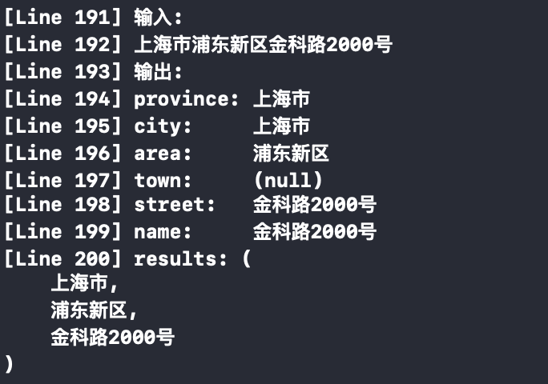
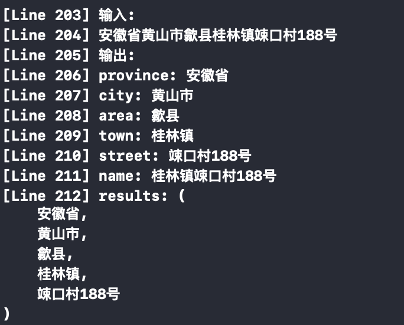
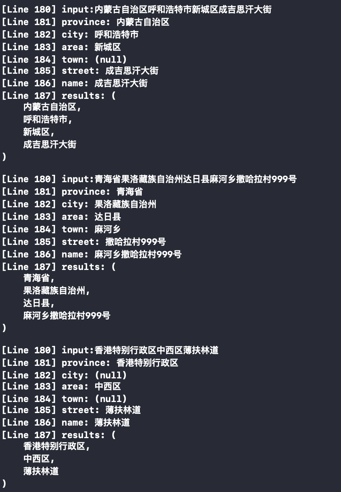

# MMLocationParser
国内地址提取出省市区街道等信息

### 概述

简单的地址字符串解析


### Usage

```
MMLocationParser *parser = [MMLocationParser parserWithLoation:@"上海市浦东新区金科路2000号"];
NSLog(@"输入:");
NSLog(@"%@",parser.location);
NSLog(@"输出:");
NSLog(@"province: %@",parser.province);
NSLog(@"city:     %@",parser.city);
NSLog(@"area:     %@",parser.area);
NSLog(@"town:     %@",parser.town);
NSLog(@"street:   %@",parser.street);
NSLog(@"name:     %@",parser.name);
NSLog(@"results: %@",parser.results);
```

### Example

* 单地址解析示例





* 批量地址解析示例

```
NSArray *list = [MMLocationParser parseList:@[
    @"上海市浦东新区金科路2000号",
    @"安徽省黄山市歙县桂林镇竦口村188号",
    @"内蒙古自治区呼和浩特市新城区成吉思汗大街",
    @"青海省果洛藏族自治州达日县麻河乡撒哈拉村999号",
    @"香港特别行政区中西区薄扶林道",
]];

for (MMLocationParser *parser in list) {
    NSLog(@"input:%@",parser.location);
    NSLog(@"province: %@",parser.province);
    NSLog(@"city: %@",parser.city);
    NSLog(@"area: %@",parser.area);
    NSLog(@"town: %@",parser.town);
    NSLog(@"street: %@",parser.street);
    NSLog(@"name: %@",parser.name);
    NSLog(@"results: %@",parser.results);
}
```

